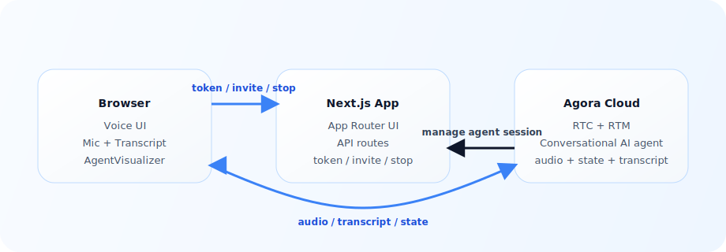

# Agora Conversational AI Next.js Quickstart

[](https://github.com/AgoraIO-Conversational-AI/agent-quickstart-nextjs/actions/workflows/build-check.yml)
[](./LICENSE)
[](https://nodejs.org/)

Build a production-style voice agent in minutes with Next.js and the Agora Conversational AI Engine, including voice agent visualizer ([Agent UIKit](https://agoraio-conversational-ai.github.io/agent-uikit/)), live transcript, and real-time pipeline latency via `AGENT_METRICS` ([Agent Toolkit](https://github.com/AgoraIO-Conversational-AI/agent-client-toolkit-ts)).

## Prerequisites

- [Node.js 22+](https://nodejs.org/en/download/)
- [pnpm](https://pnpm.io/installation)
- [Agora CLI](https://github.com/AgoraIO-Community/cli)

## Run It

Getting started is quick and easy: install the CLI _(skip if you already have it)_ , scaffold the Next.js quickstart using the Agora CLI, install dependencies, and run.

1. **Install the Agora CLI and sign in**
   _(skip if `agora` is already on your PATH)_:

   ```bash
   curl -fsSL https://raw.githubusercontent.com/AgoraIO/cli/main/install.sh | sh -s -- --add-to-path
   agora login
   ```

2. **Scaffold and run**
   `agora init` clones the starter, binds an Agora project, and writes `.env.local`. (replace `my-nextjs-demo` with your own project name):

   ```bash
   agora init my-nextjs-demo --template nextjs
   cd my-nextjs-demo
   pnpm install
   pnpm dev
   ```

3. Open [http://localhost:3000](http://localhost:3000) and click **Start conversation**.

If the agent does not join or transcripts do not appear, run **`agora project doctor --deep`** to check credentials, feature enablement, network reachability, and local env binding.

### Working from a clone of this repository

Use this path if you already cloned **this** repo (for example to contribute or fork):

```bash
git clone https://github.com/AgoraIO-Conversational-AI/agent-quickstart-nextjs.git
cd agent-quickstart-nextjs
agora login
agora project use <your-project>
pnpm install
agora project env write .env.local
agora project doctor --deep
pnpm dev
```

### Deploy to Vercel

[](https://vercel.com/new/clone?repository-url=https%3A%2F%2Fgithub.com%2FAgoraIO-Conversational-AI%2Fagent-quickstart-nextjs&project-name=agent-quickstart-nextjs&repository-name=agent-quickstart-nextjs&env=NEXT_PUBLIC_AGORA_APP_ID,NEXT_AGORA_APP_CERTIFICATE&envDescription=Agora%20credentials%20needed%20to%20run%20the%20app&envLink=https%3A%2F%2Fgithub.com%2FAgoraIO-Conversational-AI%2Fagent-quickstart-nextjs%23run-it&demo-title=Agora%20Conversational%20AI%20Next.js%20Quickstart&demo-description=Official%20Next.js%20quickstart%20for%20building%20browser-based%20voice%20AI%20with%20Agora&demo-image=https%3A%2F%2Fraw.githubusercontent.com%2FAgoraIO-Conversational-AI%2Fagent-quickstart-nextjs%2Fmain%2F.github%2Fassets%2FConversation-Ai-Client.gif)

To populate Vercel env vars from your bound Agora project:

```bash
agora project use <your-project>
agora project env write .env.local
rg "^(NEXT_PUBLIC_AGORA_APP_ID|NEXT_AGORA_APP_CERTIFICATE)=" .env.local
```

Copy those two values into Vercel Project Settings -> Environment Variables.

### Environment variables

Defined in [`env.local.example`](env.local.example).

| Variable                     | Required | Default  | Notes                                                                                          |
| ---------------------------- | :------: | :------: | ---------------------------------------------------------------------------------------------- |
| `NEXT_PUBLIC_AGORA_APP_ID`   |    ✅    |    —     | Agora Console → Project → App ID.                                                              |
| `NEXT_AGORA_APP_CERTIFICATE` |    ✅    |    —     | Agora Console → Project → App Certificate. **Server-side only.**                               |
| `NEXT_PUBLIC_AGENT_UID`      |          | `123456` | Must match the `agentUid` in [`app/api/invite-agent/route.ts`](app/api/invite-agent/route.ts). |
| `NEXT_AGENT_GREETING`        |          |    —     | Override the agent's opening line.                                                             |
| `TMDB_API_KEY`               |    ✅    |    —     | TMDB developer API key for the catalog route in [`app/api/tmdb/home/route.ts`](app/api/tmdb/home/route.ts). |

The default agent configuration in [`app/api/invite-agent/route.ts`](app/api/invite-agent/route.ts) uses Agora-managed STT, LLM, and TTS, so no extra vendor API keys are required for the base quickstart.

For WatchWise, add your TMDB key so the movie and TV rows can load from the API.

> **Default vs BYOK** — the quickstart ships with Agora-managed inference for a zero-key install. Switch to BYOK below when you need to bring your own provider quotas, models, or vendors.

## Commands

```bash
# Dev
pnpm dev                # start the Next.js dev server

# Quality
pnpm run lint           # eslint
pnpm run typecheck      # tsc --noEmit
pnpm run doctor         # local prereqs + env binding

# CI / pre-ship
pnpm run verify:api     # API contract checks
pnpm run build          # production build
pnpm run verify         # doctor + lint + typecheck + verify:api + build
```

Run `pnpm run verify` before shipping changes — it covers local prerequisites, lint, type safety, the core API route contracts, and the production build.

## Architecture

<picture>
  <source media="(prefers-color-scheme: dark)" srcset="./system-architecture-dark.svg">
  
</picture>

The browser fetches a combined RTC + RTM token (`buildTokenWithRtm`) from this app, joins the channel using a single RTC client, and uses RTM as the data channel for transcript, agent state, metrics, and error events. The Conversational AI Engine joins the same channel as the configured `NEXT_PUBLIC_AGENT_UID` and runs the STT → LLM → TTS pipeline in Agora Cloud.

## What You Get

- browser voice client built with Next.js App Router
- RTC audio plus RTM transcript and state events
- server routes for token generation, invite, and stop
- [`AgentVisualizer`](https://agoraio-conversational-ai.github.io/agent-uikit/) for agent state and a built-in transcript panel for live turns
- per-stage latency header driven by `AGENT_METRICS`
- Agora-managed default STT, LLM, and TTS configuration

## How It Works

1. The browser requests an RTC + RTM token from `/api/generate-agora-token`.
2. The backend invites an Agora cloud agent with `/api/invite-agent`.
3. The browser joins the channel and publishes mic audio.
4. The client receives transcript, agent state, and `AGENT_METRICS` (per-stage latency) events over RTM.
5. On end, the client calls `/api/stop-conversation`, logs out RTM, and unmounts the call view so Agora React hooks clean up RTC publish/join and the local microphone track.

## Optional BYOK

The quickstart defaults to Agora-managed inference. To bring your own keys, uncomment the matching blocks in [`app/api/invite-agent/route.ts`](app/api/invite-agent/route.ts) and add the corresponding env vars.

```bash
# Deepgram STT
NEXT_DEEPGRAM_API_KEY=...

# OpenAI-compatible LLM
NEXT_LLM_URL=https://api.openai.com/v1/chat/completions
NEXT_LLM_API_KEY=...

# ElevenLabs TTS
NEXT_ELEVENLABS_API_KEY=...
NEXT_ELEVENLABS_VOICE_ID=...
```

## Repo Map

- `app/api/generate-agora-token/route.ts` — issues RTC + RTM tokens
- `app/api/invite-agent/route.ts` — starts the agent session and configures the pipeline
- `app/api/stop-conversation/route.ts` — stops the agent session
- `components/LandingPage.tsx` — entry point: token fetch, RTM login, conversation lifecycle
- `components/ConversationComponent.tsx` — RTC client, transcript state, `AGENT_METRICS`, mic release
- `components/QuickstartConversationLayout.tsx` — in-call header, transcript rail, controls dock
- `components/QuickstartPipelineMetrics.tsx` — per-stage latency chips in the header
- `components/QuickstartTranscriptPanel.tsx` — live transcript rail
- `components/QuickstartPreCallCard.tsx` — pre-call hero card
- `lib/conversation.ts` — transcript normalization and visualizer state mapping
- `AGENTS.md` — primary agent-facing guide

## Troubleshooting

- **Agent does not join or transcripts are missing:** run `agora project doctor --deep`.
- **`pnpm run doctor` fails:** run `agora project env write .env.local`, then retry.
- **Manual clone / env values:** `agora project use <your-project>` then `agora project env write .env.local`.
- **RTM login fails:** keep [`app/api/generate-agora-token/route.ts`](app/api/generate-agora-token/route.ts) on `RtcTokenBuilder.buildTokenWithRtm` — RTC-only tokens will not satisfy `rtm.login`.
- **Transcript speakers inverted:** check the `uid === "0"` remap in [`components/ConversationComponent.tsx`](components/ConversationComponent.tsx).
- **Agent never appears in channel:** ensure `NEXT_PUBLIC_AGENT_UID` matches the value used in [`app/api/invite-agent/route.ts`](app/api/invite-agent/route.ts).

## More Docs

- [docs/ai/L0_repo_card.md](./docs/ai/L0_repo_card.md)
- [docs/ai/RECIPE.md](./docs/ai/RECIPE.md)
- [AGENTS.md](./AGENTS.md)

## Contributing

Pull requests welcome — see [CONTRIBUTING.md](./CONTRIBUTING.md) for development setup and conventions.

## Security

Please do **not** open public issues for security reports. Email security@agora.io with details and reproduction steps.

## License

Released under the [MIT License](./LICENSE).
